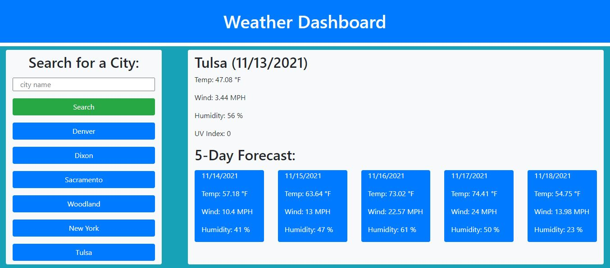

# challenge6-weather-dashboard
A weather dashboard that runs in the browser and feature dynamically updated HTML and CSS using a third-party API

## User Story
AS A traveler
I WANT to see the weather outlook for multiple cities
SO THAT I can plan a trip accordingly

## Acceptance Criteria
* A weather dashboard with form inputs
* Current and future conditions for a searched city 
* Searched cities are added to the search history
* Current weather conditions include city name, the date, an icon representation of weather conditions, the temperature, the humidity, the wind speed, and the UV index
* The UV index is color coded to indicate whether the conditions are favorable, moderate, or severe
* A 5-day forecast that displays the date, an icon representation of weather conditions, the temperature, the wind speed, and the humidity
* The search history is presented below the search
* Click on history presents the same as searching for the city

## Assets

The following image demonstrates the web application's appearance and functionality:

